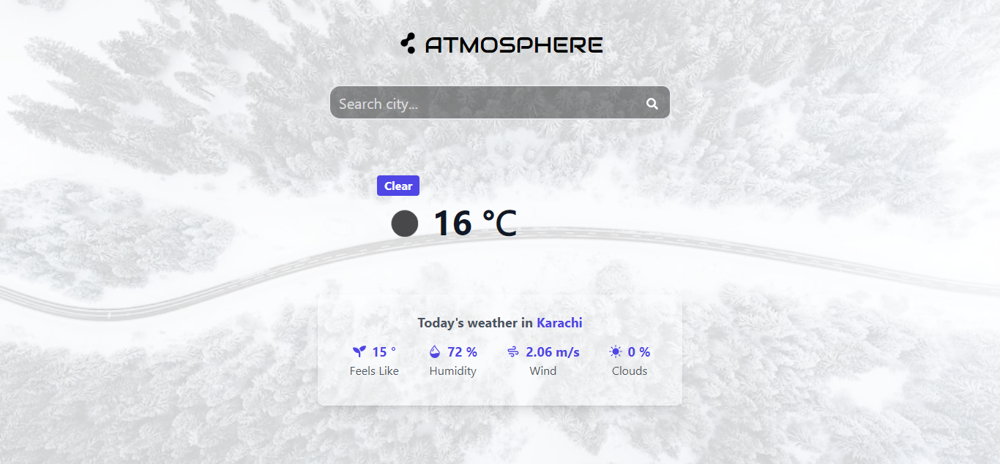

# AtmoSphere

A weather app built with the latest web technologies for optimized performance and an intuitive, visually appealing experience. **[TAKE A LOOK HERE](https://atmo-sphere.netlify.app/)**

## Technologies Stack

- Tailwind CSS for styling
- Next.js for optimized performance
- Open Weather Map API for accurate data

## Features

- Provides up-to-date weather information for any location
- Intuitive design with visually appealing interface
- Fast and responsive performance

## Application Preview



## How to run

Clone the repository and install the dependencies by running the following commands:

```
git clone https://github.com/mdazlaanzubair/AtmoSphere.git
cd AtmoSphere
npm install
```

Start the development server:

```
npm run dev
```

The app will be running on **[http://localhost:3000](http://localhost:3000)**.

## Contribution

Contributions are welcome. Feel free to submit a pull request.

## License

The project is open source and licensed under the MIT License.
